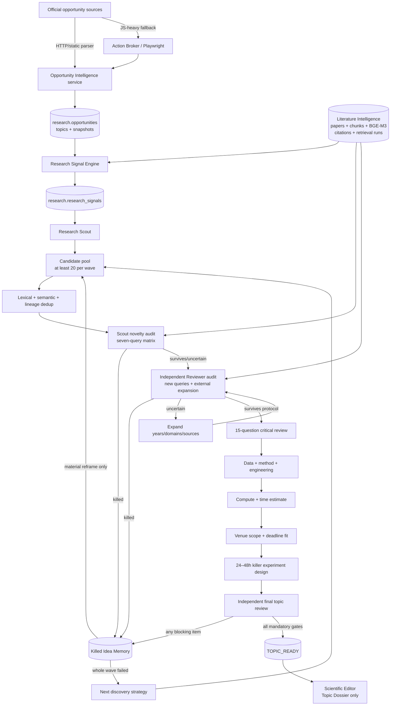

# Research OS v2 Autonomous Topic Discovery

## Scope and boundary

This phase converts current opportunity and literature evidence into a provenance-backed Topic Dossier. It stops before full experiments, manuscript generation, or submission. PostgreSQL remains the canonical scientific store; files under `reports/topic_discovery/` are projections of database records.

## Runtime architecture

## Six-role ownership

| Role | Topic-discovery responsibility |
|---|---|
| Research Scout | Opportunity monitoring, signals, candidate waves, first-pass prior search, lineage |
| Principal Investigator | Question and claim formulation, competing explanations, material reframes, method |
| Research Engineer | Dataset/code/checkpoint smoke tests and compute/runtime estimates; no full research run |
| Data Scientist | Identifiability, samples, controls, metrics, statistics, confounds |
| Scientific Editor | Topic Dossier projection after `TOPIC_READY`; no manuscript |
| Independent Reviewer | Independent queries/retrieval run, dangerous-prior attack, final blocking review |

Opportunity Intelligence is a shared data service, not a seventh agent.

## Canonical state

The topic subsystem adds the following `research` schema tables:

- `opportunities`, `opportunity_topics`, and `opportunity_snapshots` retain official-source provenance and historical content/deadline changes.
- `research_signals` records interest or problem signals while explicitly marking them as requiring literature audit.
- `idea_lineage` stores parentage, semantic fingerprints, kill reasons, killing papers, failed gates, and material-change references.
- `topic_candidates`, `novelty_audits`, `feasibility_audits`, `discovery_runs`, and `topic_dossiers` make the loop auditable and resumable.

Existing Literature Intelligence remains the only paper/retrieval store. Scout and Reviewer audits must have different `literature.retrieval_runs.retrieval_run_id` values.

## Deterministic decisions

- Opportunity status uses the current runtime clock. AOE is normalized as UTC−12, so an AOE date without an explicit time ends at 23:59:59 UTC−12.
- A closed call can generate an inspiration signal but cannot be an open submission target.
- A source failure preserves prior verified data as stale, or stores an unseen source as `UNKNOWN`; it never invents a deadline.
- A prior kills novelty only when source-backed content covers the scientific question and core claim. Title wording is not the decision boundary.
- `NOVELTY_UNCERTAIN` expands search and never becomes an automatic pass.
- `TOPIC_READY` is conjunctive. Missing data, method, controls, compute, time, deadline/future-cycle target, killer experiment, independent retrieval, or any unresolved FATAL objection blocks it.

## Trust boundaries

External HTML and API payloads are untrusted input. Fetching follows API/CLI → HTTP/static → Playwright and records the source URL, retrieval method, timestamp, and content hash. CFP themes are community-interest evidence only. External metadata never becomes a novelty conclusion until the Scout and Independent Reviewer audits compare question, claim, assumptions, method, measurement, setting, and conclusion.
